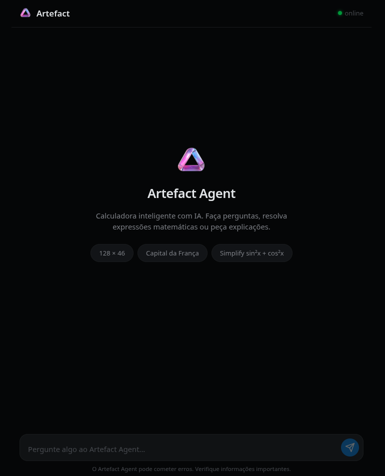

# Artefact Agent — Chat IA com Calculadora Simbólica

Um agente de IA com interface web (estilo ChatGPT), API REST e terminal.
Responde perguntas factuais **e** realiza cálculos matemáticos exatos
com [SymPy](https://www.sympy.org/). Construído com
[Agno](https://github.com/agno-agi/agno).

---

## Quick Start

```bash
# 1. Instalar dependências
uv sync

# 2. Criar .env com sua chave da OpenAI
echo "OPENAI_API_KEY=sk-proj-sua-chave-aqui" > .env

# 3. Subir o servidor
uv run uvicorn src.api.app:app --reload --port 8000
```

**→ Abra http://localhost:8000 no navegador.**

Pronto. O chat já está funcionando — digite uma pergunta ou expressão
matemática e pressione Enter.

---

## Demonstração

**Web — tela inicial:**



**Exemplos de uso na web:**

| Pergunta | O que acontece |
|----------|----------------|
| `128 * 46` | Calculadora retorna `5888` + tool call "calculator" colapsável |
| `Qual a capital da França?` | LLM responde `Paris` |
| `Meu número favorito é 42` → `Qual é meu número?` | Sessão mantém contexto |

**Também pelo terminal:**

```bash
uv run python -m src.cli
# > 128 * 46
# 5888
# > Qual a capital da França?
# Paris
```

---

## Como usar

### 1. Chat Web (recomendado)

Interface gráfica no navegador, estilo ChatGPT/Gemini.

```bash
uv run uvicorn src.api.app:app --reload --port 8000
# → http://localhost:8000
```

**Funcionalidades:**

- **Mensagens**: pergunta do usuário à direita, resposta do agente à esquerda
- **Tool calls**: quando o agente usa a calculadora, aparece um detalhe
  colapsável com nome da ferramenta, entrada, saída e duração
- **Sessão persistente**: o navegador guarda um `session_id` no
  `localStorage` — perguntas de acompanhamento mantêm contexto
- **Sugestões**: três botões de exemplo na tela inicial para começar rápido
- **Health check**: indicador visual no cabeçalho mostra se o servidor está
  online, em modo calculadora ou offline
- **Responsivo**: funciona em mobile e desktop

**Estados da interface:**

| Estado | O que aparece |
|--------|---------------|
| Tela inicial | Logo, descrição, botões de sugestão |
| Carregando | Bolinhas animadas ("digitando...") |
| Resposta recebida | Mensagem do agente + tool calls (se houver) |
| Erro de rede | Toast "Erro de conexão" + mensagem no chat |
| Timeout | "O agente demorou muito para responder" |
| Servidor degradado | Indicador "modo calculadora" no cabeçalho |

---

### 2. API REST (para desenvolvedores)

Endpoint HTTP que expõe o agente para integração com outras ferramentas.

```bash
# Iniciar servidor
uv run uvicorn src.api.app:app --reload --port 8000
```

http://localhost:8000/docs

**Endpoints:**

| Método | Rota | Descrição |
|--------|------|-----------|
| GET | `/` | Chat web (index.html) |
| GET | `/static/*` | Arquivos estáticos (CSS, JS) |
| POST | `/query` | Enviar pergunta ao agente |
| GET | `/health` | Status do servidor |
| GET | `/docs` | Documentação interativa (Swagger) |

#### POST /query

Envia uma pergunta ou expressão matemática para o agente.

**Requisição:**

```json
{
  "query": "128 * 46",
  "session_id": "abc-123",
  "verbose": true
}
```

| Campo | Tipo | Obrigatório | Padrão | Descrição |
|-------|------|-------------|--------|-----------|
| `query` | string | sim | — | Pergunta ou expressão (1–10.000 caracteres) |
| `session_id` | string | não | `null` | ID para conversa multi-turn |
| `verbose` | boolean | não | `false` | Incluir detalhes de ferramentas usadas |

**Resposta 200 (sucesso):**

```json
{
  "response": "5888",
  "tool_calls": [
    {
      "tool_name": "calculator",
      "input": "128 * 46",
      "output": "5888",
      "duration_ms": 12
    }
  ]
}
```

`tool_calls` só aparece quando `verbose: true` e o agente usou ferramentas.


**Respostas de erro:**

| Código | Significado |
|--------|-------------|
| `413` | Query excede 10.000 caracteres |
| `422` | Query vazia ou payload inválido |
| `504` | Agente não respondeu em 30 segundos (timeout) |

---

### 3. Terminal (CLI)

Modo texto direto no terminal, sem precisar de servidor HTTP.

```bash
# Modo normal
uv run python -m src.cli

# Modo verbose (mostra ferramentas usadas)
uv run python -m src.cli --verbose
```

**Comandos dentro do CLI:**

| O que digitar | O que acontece |
|---------------|----------------|
| Pergunta qualquer (ex: `Qual a capital da França?`) | LLM responde do conhecimento dele |
| Expressão matemática (ex: `128 * 46`) | SymPy calcula e retorna o resultado exato |
| Pergunta com cálculo implícito (ex: `quantos segundos em um dia?`) | LLM detecta que precisa calcular e usa a calculadora |
| `exit` ou `quit` | Sai do programa |

**Exemplo de sessão:**

```
$ uv run python -m src.cli
Artefact Agent — type 'exit' or 'quit' to stop.

> Qual a capital da França?
Paris

> 128 * 46
5888

> qual o seno de 60?
sqrt(3)/2

> quantos segundos há em um dia?
86400

> exit
```

---

## Como funciona

### Arquitetura

```text
                      +---------------------------+
                      |    Entrada do usuario     |
                      |  (Web / API / Terminal)   |
                      +------------+--------------+
                                   |
                                   v
                      +---------------------------+
                      |    Roteador               |
                      |  (run_with_context)       |
                      +------------+--------------+
                                   |
                    +--------------+--------------+
                    |                             |
                    v                             v
        +--------------------+       +------------------------+
        | Expressao pura?    |  Nao  |  Agno Agent (LLM)      |
        | (so matematica)    |-----> |  - OpenAI / Groq       |
        +--------+-----------+       +-----------+------------+
                 | Sim                          | usou tool?
                 v                              v
        +--------------------+       +------------------------+
        |  SymPy             |       |  calculator_tool       |
        |  sympify()         |<------|  -> SymPy              |
        |  resultado exato   |       +------------------------+
        +--------------------+
```

### Roteamento inteligente

Toda entrada passa pelo `_is_pure_math()` em `src/agent.py:22` (o vocabulário matemático fica em `src/math_words.py`):

1. A string contém **apenas** caracteres válidos para matemática?
   (números, operadores, parênteses, espaços)
2. Todas as palavras estão numa **whitelist** de funções matemáticas?
   (`sin`, `cos`, `factor`, `simplify`, `pi`, `x`, …)

Se **sim** → roteia direto pra calculadora SymPy (sem custo de API, sem
latência de LLM).

Se **não** → envia pro Agno Agent, que decide se usa a calculadora ou
responde do conhecimento interno.

### Persistência com SQLite

O Agno Agent salva automaticamente cada interação em
`sessions/agent.db` via `SqliteDb`. Na próxima execução (mesmo em outro
terminal ou após reiniciar o servidor), o histórico é carregado:

```
▶ uv run python -m src.cli
> Meu nome é Jady.
Prazer, Jady!

▶ (fecha terminal, abre de novo)
> Qual é meu nome?
Seu nome é Jady!   ← carregou do SQLite
```

**Nota sobre sessões na API:** a FastAPI combina duas camadas:

1. **Dict em memória** (`_sessions` em `routes.py`) — cache de objetos
   Agent para evitar recriar o cliente OpenAI a cada requisição.
2. **SQLite** — persistência real do histórico, gerenciada pelo Agno
   Agent via `session_id`.

Se o servidor reiniciar, o dict é perdido, mas o SQLite mantém o
histórico. Um novo `Agent(session_id="X")` recria o cliente e carrega
as mensagens anteriores do banco.

Expressões puras roteadas diretamente para a calculadora (sem passar
pelo LLM) não persistem no banco — economia de tokens de API.

### Graceful degradation

Quando o LLM está indisponível (API key inválida, rate limit 429,
autenticação) o sistema detecta e:

1. Exibe um aviso: "AI knowledge source unavailable"
2. Entra em **modo calculadora-only**
3. Continua aceitando expressões matemáticas e calculando com SymPy
4. O health endpoint reflete o estado: `{"status": "degraded",
   "mode": "calculator-only"}`

---

## Qual foi sua lógica de implementação

### 1. CLI primeiro, API depois, UI por último

O projeto começou como um agente de terminal puro (spec 001). A
prioridade era validar o roteamento inteligente entre LLM e calculadora
sem a complexidade de um servidor HTTP. Depois que a lógica central
estava sólida, a API REST foi adicionada (spec 002) para expor o agente
como serviço. A UI web veio por último (spec 003), consumindo a API
existente — sem precisar alterar o core do agente.

**Por quê:** cada camada adiciona complexidade. Separar em fases
permitiu testar e estabilizar cada uma antes de prosseguir.

### 2. Roteamento semântico: calculadora sem LLM

A decisão mais importante: **não usar o LLM para expressões puramente
matemáticas.** O `_is_pure_math()` em `src/agent.py` verifica se a
entrada contém apenas matemática válida. Se sim, roteia direto para o
SymPy — zero latência de API, zero custo de tokens.

O vocabulário de funções matemáticas (`src/math_words.py`) foi
construído manualmente com base nas funções do SymPy que fazem sentido
para um usuário final (trigonométricas, simplificação, cálculo,
álgebra). Isso evita falsos positivos (palavras como "sin" vs. "sink")
e garante que expressões inválidas caiam no LLM para interpretação.

### 3. Agno Agent como orquestrador, não como framework monolítico

O [Agno](https://github.com/agno-agi/agno) foi escolhido por ser
mínimo: ele gerencia o loop de conversação com o LLM, a execução de
ferramentas (`calculator_tool`) e a persistência em SQLite — mas não
impõe uma arquitetura. O roteamento `_is_pure_math()` roda **antes**
do Agno, desviando tráfego da API paga.

As instruções (`src/instructions.py`) são o "cérebro" do agente: 8
regras que dizem ao LLM quando usar a calculadora, como formatar
respostas e como se comportar. Separar em arquivo próprio permite
ajustar o comportamento sem tocar no código de criação do agente.

### 4. FastAPI como servidor único (sem Nginx, sem CORS)

A UI web é servida pelo próprio FastAPI (`src/api/static/` montado em
`/static/`). Não há proxy reverso, servidor de arquivos separado nem
configuração de CORS — tudo roda na mesma origem (porta 8000).

### 5. Sessão do lado do cliente (localStorage)

Em vez de gerenciar sessões no servidor com cookies, a UI gera um UUID
e guarda no `localStorage` do navegador. Esse UUID é enviado como
`session_id` em toda requisição. O servidor usa o session_id para
carregar o histórico do SQLite via Agno.

**Por quê:** (a) sem dependência de cookie/sessão server-side, (b) o
cliente controla a identidade da conversa, (c) funciona em qualquer
cliente HTTP (curl, Postman, código) sem configuração extra.

### 6. Testes em camadas

Cada camada tem seu próprio nível de teste.

Isso permite que a maioria dos testes (50 de 61) rode sem API key da
OpenAI, usando mocks. Apenas os testes de browser que chamam o LLM
real precisam da chave configurada.

---

## Testes

61 testes no total, divididos em 4 camadas:

```bash
# Todos os testes
uv run pytest tests/ -v

# Apenas unidade (calculadora + agente)
uv run pytest tests/unit/ -v

# Apenas integração (CLI)
uv run pytest tests/integration/ -v

# Apenas API (endpoints HTTP)
uv run pytest tests/api/ -v

# Apenas E2E HTTP (frontend serving)
uv run pytest tests/e2e/test_frontend.py -v

# E2E com Playwright (browser headless)
uv run pytest tests/e2e/test_e2e_browser.py -v

# E2E com Playwright (browser visível)
E2E_HEADED=1 uv run pytest tests/e2e/test_e2e_browser.py -v
```

| Camada | Arquivos | Testes | O que cobre |
|--------|----------|--------|-------------|
| Unit | `test_calculator.py`, `test_agent.py` | 25 | Aritmética, funções simbólicas, roteamento, contexto |
| Integration | `test_cli.py` | 7 | Fluxo completo via stdin/stdout |
| API | `test_query.py`, `test_health.py` | 12 | Endpoints /query e /health |
| E2E HTTP | `test_frontend.py` | 11 | HTML serve, assets estáticos, integração com health |
| E2E Browser | `test_e2e_browser.py` | 6 | Playwright: abrir página, digitar, enviar, ver resposta |

---

## Estrutura do projeto

```
src/
├── agent.py           # Criação do Agno Agent, roteamento, contexto
├── cli.py             # REPL loop, entrada/saída, --verbose
├── instructions.py    # Instruções de comportamento do agente (8 regras)
├── math_words.py      # Vocabulário de funções matemáticas (65+ palavras)
├── api/
│   ├── __init__.py
│   ├── app.py         # FastAPI app, lifespan, logging middleware
│   ├── routes.py      # /query e /health endpoints
│   └── static/        # Chat web (index.html, style.css, app.js)
├── tools/
│   └── calculator.py  # Tool SymPy para Agno + função evaluate()

tests/
├── unit/
│   ├── test_agent.py       # Roteamento, contexto, ambiguidade
│   └── test_calculator.py  # Aritmética, simbólica, erros
├── integration/
│   └── test_cli.py    # Fluxo completo via stdin/stdout mockado
├── api/
│   ├── test_query.py  # Endpoint /query (10 testes)
│   └── test_health.py # Endpoint /health (2 testes)
└── e2e/
    ├── test_frontend.py      # HTTP-level (11 testes)
    └── test_e2e_browser.py   # Playwright browser (6 testes)
```

---

## Especificações

### CLI Agent (`specs/001-cli-agent-calculator/`)

| Documento | Conteúdo |
|-----------|----------|
| `spec.md` | User stories, critérios de aceitação, requisitos |
| `plan.md` | Stack, estrutura, constitution check |
| `tasks.md` | 40 tarefas em 7 fases, todas concluídas |
| `data-model.md` | Entidades: Session, Message, ToolCall |
| `contracts/` | CLI Interface e Calculator Tool contracts |
| `quickstart.md` | Guia rápido de setup e uso |
| `research.md` | Decisões técnicas e alternativas |

### FastAPI API (`specs/002-fastapi-agent-api/`)

| Documento | Conteúdo |
|-----------|----------|
| `spec.md` | User stories, FRs, edge cases |
| `plan.md` | Stack, estrutura, fases de implementação |
| `tasks.md` | 26 tarefas em 7 fases, todas concluídas |
| `data-model.md` | Entidades: QueryRequest, Session, ToolCall |
| `contracts/` | API Contracts (query, health) |
| `quickstart.md` | Guia rápido de execução |
| `research.md` | Decisões técnicas |

### Chat UI (`specs/003-ui-chat-interface/`)

| Documento | Conteúdo |
|-----------|----------|
| `spec.md` | User stories, requisitos da UI, edge cases |

### End-to-End Tests (`specs/004-end-to-end-tests/`)

| Documento | Conteúdo |
|-----------|----------|
| `spec.md` | User stories, requisitos de teste, cenários |

---

## O que aprendi

### FastAPI como servidor único

O FastAPI servindo HTML, CSS, JS e API na mesma origem simplificou
drasticamente o deploy. Sem configuração de CORS, sem proxy reverso,
sem servidor de arquivos separado. Para projetos de médio porte, isso
elimina uma camada inteira de complexidade de infraestrutura.

### Sessão do lado do cliente com localStorage

Em vez de sessions server-side com cookies, um UUID gerado no
navegador e persistido em `localStorage` resolve a identidade da
conversa. Isso desacopla o cliente do servidor: o backend não precisa
gerenciar estado de sessão — apenas carrega o histórico do SQLite
quando recebe um `session_id`.

### SymPy para cálculo simbólico

Diferente de uma calculadora numérica comum, o SymPy opera com
expressões simbólicas: `sin(x)^2 + cos(x)^2` simplifica para `1`,
`integrate(x^2, x)` retorna `x^3/3`. Isso permite que o agente resolva
álgebra, cálculo, trigonometria e física de forma exata — sem
aproximações de ponto flutuante.

### Skill impeccable para o frontend

A skill `impeccable` do opencode orientou o design da UI com
princípios concretos: paleta OKLCH (sem `#000` ou `#fff`), estratégia
de cor Restrained para o tema escuro, proibição de padrões "AI slop"
(glassmorphism, gradient text, side-stripe borders). O resultado é uma
interface que não parece genérica.

### Roteamento _is_pure_math antes do LLM

Uma verificação com regex + whitelist de funções matemáticas roda **antes** de qualquer chamada ao
LLM. Se a entrada é matemática pura, vai direto para o SymPy. Isso
economiza tokens de API, elimina latência de rede e funciona mesmo sem
chave da OpenAI configurada.

## O que eu faria diferente com mais tempo de desenvolvimento

### Streaming de respostas (Server-Sent Events)

A API atual espera o agente processar a resposta inteira antes de
retornar. Com SSE, o navegador poderia exibir o texto token por token
— igual ChatGPT. Isso melhora drasticamente a percepção de velocidade
e permite cancelar requisições em andamento.


### Barra lateral de histórico

Uma sidebar listando conversas anteriores, com busca e a possibilidade
de renomear/exportar sessões. O SQLite já armazena todo o histórico —
falta apenas uma UI para navegá-lo.


### Container Docker

Um `Dockerfile` multi-estágio que builda e sobe o servidor em segundos.
Facilita deploy em qualquer ambiente sem depender do runtime Python local.


### Mais ferramentas (tools)

Além da calculadora, o agente poderia ter ferramentas para buscar na
web, converter unidades, ou consultar APIs externas — tudo via o sistema de tools do Agno.
